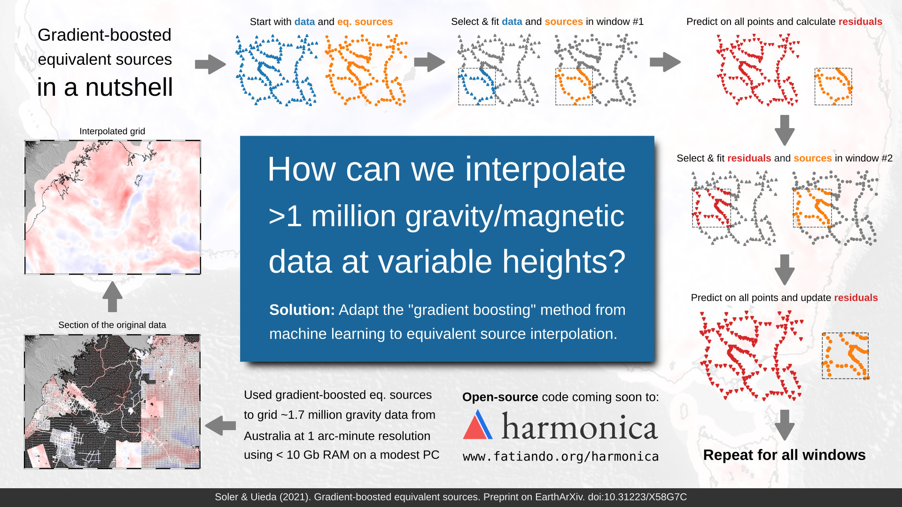

# Gradient-boosted equivalent sources

by
[Santiago Soler](https://santisoler.github.io)
and [Leonardo Uieda](https://leouieda.com)


This paper has been published in *Geophysical Journal International*.
The version of record

> Soler, S. R. and Uieda, L. (2021).
> Gradient-boosted equivalent sources,
> _Geophysical Journal International_.
> doi: [10.1093/gji/ggab297](https://doi.org/10.1093/gji/ggab297)

is available online at: [doi.org/10.1093/gji/ggab297](https://doi.org/10.1093/gji/ggab297)

A pre-copyedited, author-produced PDF of an article is available on EarthArXiv
at [doi.org/10.31223/X58G7C](https://doi.org/10.31223/X58G7C)

**This repository contains the data and code used to produce all results and figures shown
in the paper.**
An archived version of this repository is available at
[doi.org/10.6084/m9.figshare.13604360](https://doi.org/10.6084/m9.figshare.13604360)


## About

We present the gradient-boosted equivalent sources: a new methodology for
interpolating very large datasets of gravity and magnetic observations even on
modest personal computers, without the high computer memory needs of the
classical equivalent sources technique.
This new method is inspired by the gradient-boosting technique, mainly used in machine learning solutions.



## Abstract

The equivalent source technique is a powerful and widely used method for
processing gravity and magnetic data. Nevertheless, its major
drawback is the large computational cost in terms of processing time and
computer memory.
We present two techniques for reducing the computational cost of equivalent
source processing: block-averaging source locations and the
gradient-boosted equivalent source algorithm.
Through block-averaging, we reduce the number of source coefficients that
must be estimated while retaining the minimum desired resolution in the final
processed data.
With the gradient boosting method, we estimate the sources coefficients in
small batches along overlapping windows, allowing us to reduce the computer
memory requirements arbitrarily to conform to the constraints of the
available hardware.
We show that the combination of block-averaging and gradient-boosted
equivalent sources is capable of producing accurate interpolations through
tests against synthetic data.
Moreover, we demonstrate the feasibility of our method by gridding a gravity
dataset covering Australia with over 1.7 million observations using a modest
personal computer.

## Reproducing the results

You can download a copy of all the files in this repository by cloning the
[git](https://git-scm.com/) repository:

    git clone https://github.com/compgeolab/eql-gradient-boosted

or [click here to download a zip archive](https://github.com/compgeolab/eql-gradient-boosted/archive/master.zip).

All source code used to generate the results and figures in the paper are in
the `notebooks` folder. There you can find the [Jupyter](https://jupyter.org/)
notebooks that performs all the calculations to generate all figures and
results presented in the paper.
Inside the `notebooks/boost_and_layouts` folder you can find the Python files
that define functions and classes that implement the new methodologies
introduced in the paper.

The sources for the manuscript text and figures are in `manuscript`.

See the `README.md` files in each directory for a full description.

### Setting up your environment

You'll need a working Python 3 environment with all the standard
scientific packages installed (numpy, pandas, scipy, matplotlib, etc).
The easiest (and recommended) way to get this is to download and install the
[Anaconda Python distribution](https://www.anaconda.com/).

Besides the standard scientific packages that come pre-installed with Anaconda,
you'll also need to install some extra libraries like: Numba for just-in-time
compilation; Harmonica, Verde, Boule and Pooch from the
[Fatiando a Terra](https://www.fatiando.org) project; Cartopy and PyGMT for
generating maps and more.

Instead of manually install all the dependencies, they can all be automatically
installed using a conda environment.

1. Change directory to the cloned git repository:
   ```
   cd eql-gradient-boosted
   ```
2. Create a new conda environment from the `environment.yml` file:
   ```
   conda env create -f environment.yml
   ```
3. Activate the new environment:
   ```
   conda activate eql-gradient-boosted
   ```

For more information about managing conda environments visit this
[User Guide](https://conda.io/docs/user-guide/tasks/manage-environments.html)

### Reproducing the results

We have a `Makefile` that provides commands that automatically run the
notebooks, run the tests, check code style, etc.

In order to be able to use it, you would need to install
[GNU Make](https://www.gnu.org/software/make/).
It comes pre-installed with most of the GNU/Linux distributions, or it can be
installed through the package manager of your OS.
If you're running Windows or Mac OS, you can install `make` through `conda`:

```
conda install --channel conda-forge make
```

Then you can automatically rerun all the notebooks with:

```
make run
```

> Some notebooks might take several minutes to run, depending on the resources
> of your system
> The notebook that grids the Australia gravity data would need around 12GB of
> RAM in order to estimate the coefficients through the gradient-boosted
> equivalent sources.

### Testing the code and check style

You can also use the `Makefile` to run the unit tests for our gradient-boosting
implementation, the construction of source layouts and more:

```
make test
```

You also check if the code follows the styles from PEP8:

```
make check
```

Or automatically reformat it through [Black](https://github.com/psf/black):

```
make format
```

For more commands defined in the `Makefile`, please run:

```
make help
```

## License

All source code is made available under a BSD 3-clause license. You can freely
use and modify the code, without warranty, so long as you provide attribution
to the authors. See `LICENSE.md` for the full license text.

Manuscript text, figures, data and the results of numerical tests are available
under the
[Creative Commons Attribution 4.0 License (CC-BY)](https://creativecommons.org/licenses/by/4.0/).
