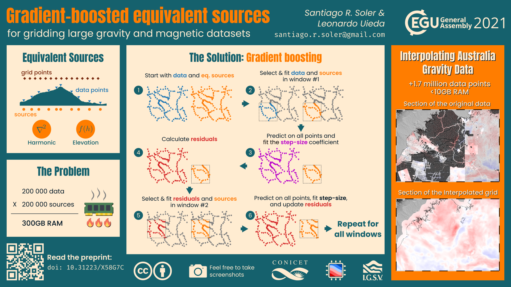

# Gradient-boosted equivalent sources for gridding large gravity and magnetic datasets

[Santiago Soler](https://santisoler.github.io/)1,2
and
[Leonardo Uieda](https://www.leouieda.com/)3

> 1CONICET, Argentina 
> 2Instituto Geofísico Sismológico Volponi, Universidad Nacional de San Juan, Argentina 
> 3Department of Earth, Ocean and Ecological Sciences, School of Environmental Sciences, University of Liverpool, UK 

Presented at the EGU21 General Assembly.

|        |Info|
|-------:|:---|
|Session | [G4.3 Acquisition and processing of gravity and magnetic field data and their integrative interpretation](https://meetingorganizer.copernicus.org/EGU21/session/39917) |
|Abstract | doi:[10.5194/egusphere-egu21-1276](https://doi.org/10.5194/egusphere-egu21-1276) |
|vPICO Single Slide | doi:[10.6084/m9.figshare.14461792](https://doi.org/10.6084/m9.figshare.14461792) |

The slide has been created through Inkscape using the figures generated after
the first submission of the article to GJI.

## Abstract

The equivalent source technique is a well known method for interpolating
gravity and magnetic data. It consists in defining a set of finite sources that
generate the same observed field and using them to predict the values of the
field at unobserved locations. The equivalent source technique has some
advantages over general-purpose interpolators: the variation of the field due
to the height of the observation points is taken into account and the predicted
values belong to an harmonic field. These make equivalent sources a more suited
interpolator for any data deriving from a harmonic field (like gravity
disturbances and magnetic anomalies). Nevertheless, it has one drawback: the
computational cost. The process of estimating the coefficients of the sources
that best fit the observed values is very computationally demanding: a Jacobian
matrix with number of observation points times number of sources elements
must be built and then used to fit the source coefficients though a
least-squares method. Increasing the number of data points can make the Jacobian
matrix to grow so large that it cannot fit in computer memory.

We present a gradient-boosting equivalent source method for interpolating large
datasets. In it, we define small subsets of equivalent sources that are fitted
against neighbouring data points. The process is iteratively carried out,
fitting one subset of sources on each iteration to the residual field from
previous iterations. This new method is inspired by the gradient-boosting
technique, mainly used in machine learning solutions.

We show that the gradient-boosted equivalent sources are capable of producing
accurate predictions by testing against synthetic surveys. Moreover, we were
able to grid a gravity dataset from Australia with more than 1.7 million points
on a modest personal computer in less than half an hour.

## Licenses

The slides and the abstract are licensed under a
[Creative Commons Attribution 4.0 International License][cc-by].

[![CC BY 4.0][cc-by-image]][cc-by]

The fonts included under the `fonts` directory are released under the SIL Open
Font License (Version 1.1). The full license text can be found inside each
zipped file.

The `draws/flame.svg` and `draws/ram.svg` files are released under the Flaticon
License authored by
[Vectors Market](https://www.flaticon.com/free-icon/flame_426833?term=fire&page=1&position=3&page=1&position=3&related_id=426833&origin=search#)
and
[Smashicons](https://www.flaticon.com/free-icon/flame_426833?term=fire&page=1&position=3&page=1&position=3&related_id=426833&origin=search#), respectively.
The Flaticon License make them available for _"free for personal and commercial
purpose with attribution"_, in a similar way to the CC-BY license.

[cc-by]: http://creativecommons.org/licenses/by/4.0/
[cc-by-image]: https://i.creativecommons.org/l/by/4.0/88x31.png
